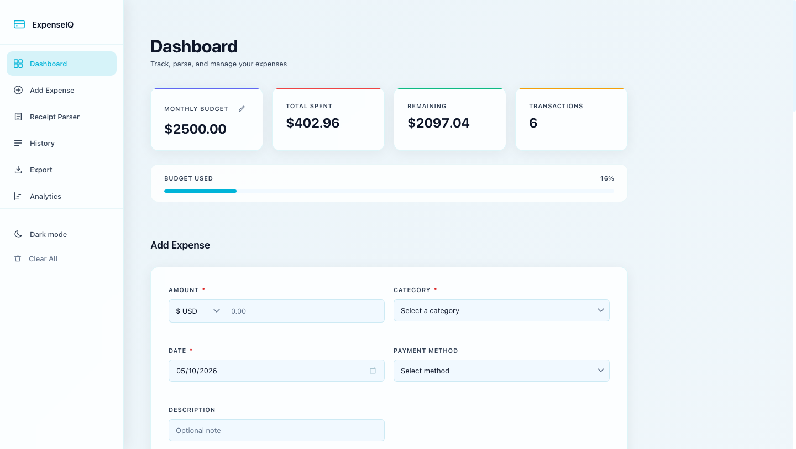
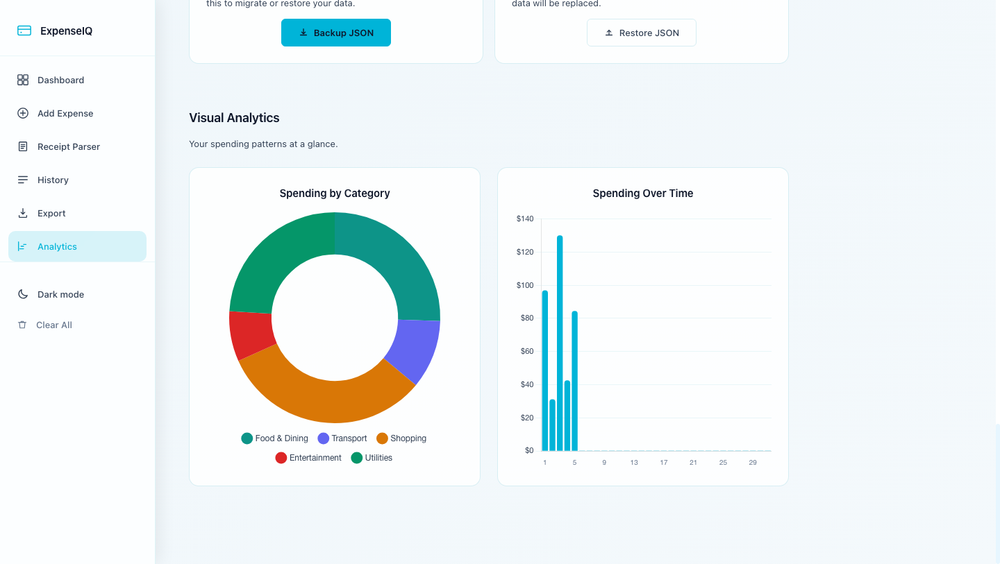
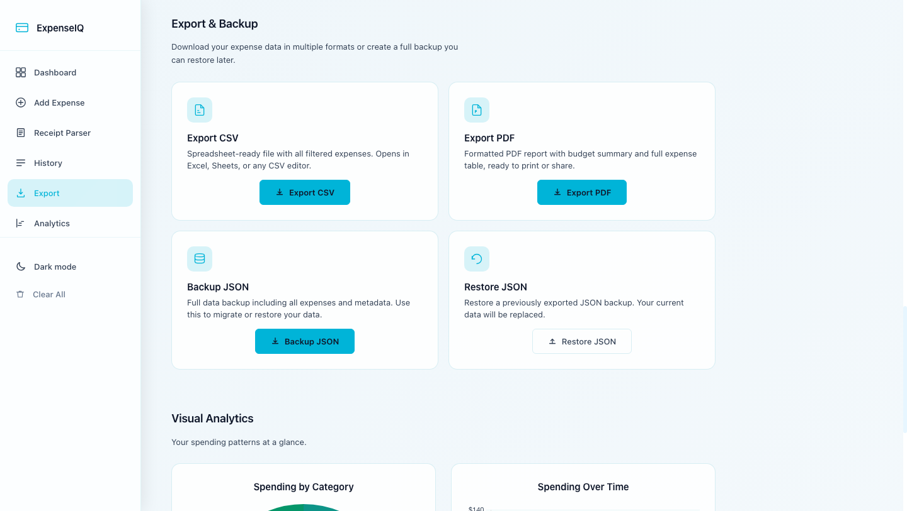
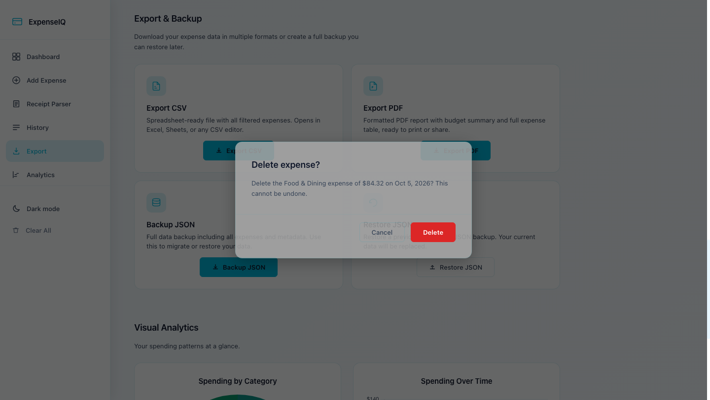
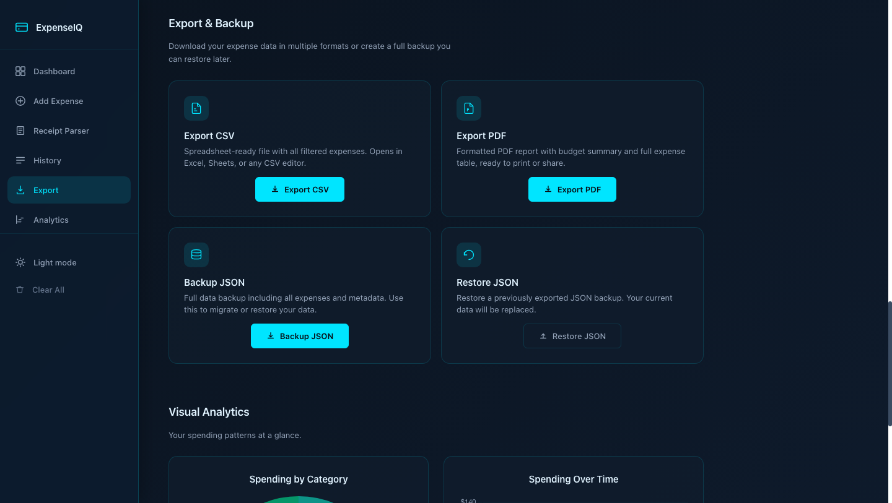
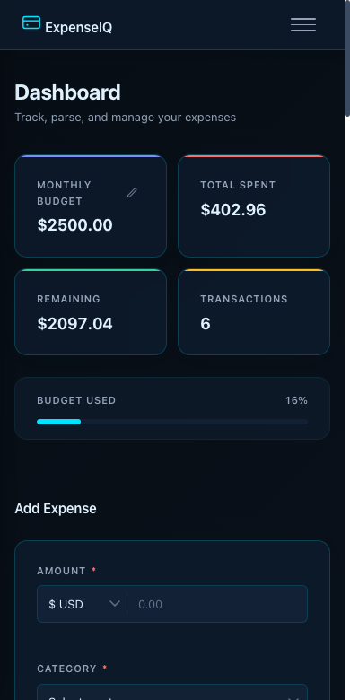

# ExpenseIQ — Smart Expense Tracker

A privacy-first expense tracker that runs entirely in your browser. Track expenses, parse receipts, manage budgets, visualise spending, and export your data — no accounts, no servers, no tracking.



## Features

- **Expense tracking** — add, edit, and delete expenses with category, date, payment method, description, and per-expense currency.
- **Receipt parser** — paste raw receipt text and it extracts the vendor, total, and date to pre-fill the form.
- **Budgets** — set a monthly budget with live progress, remaining balance, and over-budget warnings.
- **Visual analytics** — spending by category (doughnut) and daily spending over the current month (bar), powered by Chart.js.
- **History controls** — search, filter by category or payment method, and sort by date or amount.
- **Export & backup** — CSV (spreadsheet-ready, formula-injection safe), PDF report, and JSON backup/restore.
- **Multiple currencies** — INR, USD, EUR, SEK, KWD, and SAR, each with correct symbol placement.
- **Themes** — light and dark mode with a system-aware default.
- **Offline PWA** — installable, with a service worker that caches the app shell.
- **Cross-tab sync** — changes in one tab update other open tabs.

## Screenshots

### Analytics



### Export & Backup



### Confirm dialogs



### Dark mode



### Mobile



## Tech stack

- Vanilla HTML, CSS, and JavaScript — no build step, no framework.
- [Chart.js 4.5.1](https://www.chartjs.org/) and [html2pdf.js 0.10.1](https://github.com/eKoopmans/html2pdf.js) are loaded from CDNs, pinned with Subresource Integrity (SRI).
- `localStorage` for persistence; session storage for rate caching.
- Service worker (`sw.js`) + web app manifest for offline use and installability.
- Content Security Policy and SRI for a hardened static deployment.

## Getting started

Clone the repo and serve it with any static server:

```bash
git clone https://github.com/falaque-m-dev/smart-expense-tracker.git
cd smart-expense-tracker
python3 -m http.server 8000
# open http://localhost:8000
```

You can also open `index.html` directly, but the service worker (offline mode) only registers over `http(s)`.

## Tests

The end-to-end suite drives the real UI in headless Chrome and verifies the full feature set, layout at nine viewport widths, CSV/PDF/JSON exports, backup/restore, accessibility behaviours, and that there are no uncaught console errors.

```bash
node tests/e2e.js
# or against a served copy:
E2E_URL=http://localhost:8000/index.html node tests/e2e.js
```

Requirements: Node.js 18+ and Google Chrome. Set `CHROME_PATH` if Chrome is not in the default macOS location.

## Project structure

```
.
├── index.html
├── styles.css
├── app.js
├── sw.js                  # service worker (offline shell)
├── manifest.webmanifest   # PWA manifest
├── icon.svg
├── icon-192.png
├── icon-512.png
├── screenshots/
└── tests/
    └── e2e.js
```

## Privacy

All expense data stays in your browser's local storage. Nothing is sent to a server. The only external requests are the two pinned CDN scripts (Chart.js and html2pdf.js).
